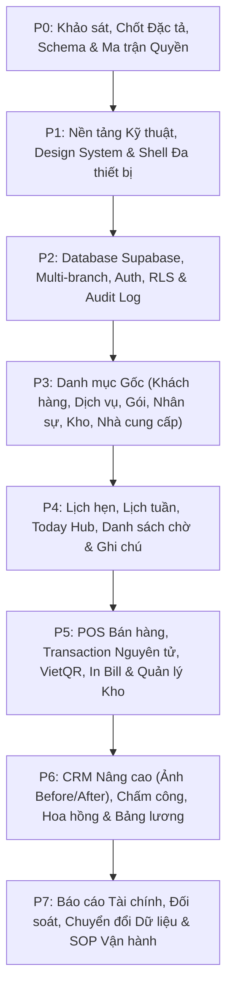

# 📋 ĐẶC TẢ TRIỂN KHAI VÀ MASTER PLAN: VUA APP — SPA & NHA KHOA
**Tài liệu chuẩn: PLAN_VUA_APP_ANTIGRAVITY.md**
**Phiên bản:** 1.0 • Ngày 27/09/2026 • Chuẩn mực Triển khai & Nghiệm thu cho Antigravity

---

## 1. MỤC TIÊU VÀ NGUYÊN TẮC THIẾT KẾ

Xây dựng lại **VUA APP** thành hệ thống quản lý vận hành tập trung trên nền tảng đám mây (**Cloud Realtime**), phục vụ đồng thời **nhiều người dùng, nhiều chi nhánh và đa thiết bị** (Mobile, iPad, Desktop POS). Hệ thống giữ trọn vẹn 21 phân hệ chức năng thực tế của bản hiện tại, đồng thời khắc phục triệt để các rủi ro về lưu trữ trình duyệt, giao dịch tiền tệ, sai lệch tồn kho và bảo mật phân quyền.

### 🎯 Mục tiêu thành công cốt lõi:
1. **Dữ liệu đồng bộ Realtime & Bảo mật tại Database:** Phân quyền chặt chẽ tại tầng PostgreSQL (Row Level Security), không chỉ ẩn nút trên giao diện.
2. **Giao dịch Bán hàng Nguyên tử (ACID Transactions):** Không tạo trùng giao dịch, không bao giờ xảy ra tình trạng trừ kho mà thiếu hóa đơn.
3. **Đối soát chính xác 100%:** Hóa đơn, tiền thực thu, công nợ, tồn kho và số buổi liệu trình luôn đối soát được với chứng từ gốc.
4. **Kế hoạch chuyển đổi dữ liệu tin cậy:** Có công cụ nhập dữ liệu cũ (Import dry-run), sao lưu (Backup) và phục hồi (Restore) được kiểm chứng thực tế.
5. **Tối ưu trải nghiệm Đa thiết bị:**
   - 📱 **Nhân viên / KTV / Bác sĩ (Mobile/iPad):** Thao tác chạm vuốt mượt mà, chụp ảnh Before/After bằng camera iPad, giao diện không tràn viền.
   - 💻 **Lễ tân / Thu ngân (Desktop/POS):** Lưới lịch tuần trực quan, màn hình POS 2 cột lớn, phím tắt nhanh, in bill nhiệt K80/K58.
6. **Kiểm thử & Nghiệm thu nghiêm ngặt:** Mỗi Phase đều có bộ tiêu chí nghiệm thu rõ ràng (Checkpoint) và bằng chứng kiểm thử trước khi chuyển bước.

---

## 2. QUYẾT ĐỊNH KỸ THUẬT MẶC ĐỊNH (DEFAULT DECISIONS)

| Chủ đề | Quyết định kỹ thuật bắt buộc |
| :--- | :--- |
| **Mô hình tổ chức** | Đa doanh nghiệp, đa chi nhánh: bảng nghiệp vụ luôn có `organization_id` và `branch_id`. |
| **Ngành hoạt động** | Hỗ trợ 2 chế độ `Spa` và `Nha khoa`. Chuyển đổi theo ngữ cảnh chi nhánh thực tế, không dùng lẫn dữ liệu. |
| **Tiền tệ & Số học** | Đơn vị **VND**; số tiền lưu bằng **số nguyên đồng (Integer/Bigint)**, tuyệt đối không dùng số thực (Float) để tính tiền. |
| **Múi giờ & Ngày giờ** | Múi giờ nghiệp vụ: `Asia/Ho_Chi_Minh`. Lưu trữ bằng `timestamptz`, ngày nghiệp vụ tính theo múi giờ chi nhánh. |
| **Chế độ Ngoại tuyến (Offline)** | Được **XEM** dữ liệu đã cache khi mất mạng; **KHÔNG cho phép xác nhận thanh toán, thay đổi kho, trừ liệu trình khi offline**. |
| **Thanh toán VietQR** | Mức 1: Tạo QR động kèm số tiền/mã bill, xác nhận tiền thủ công có lưu audit. Mức 2 (Mở rộng): Tự động khớp qua Webhook ngân hàng. |
| **Mẫu In hóa đơn** | Hỗ trợ in nhiệt khổ 58mm và 80mm chuẩn CSS `@media print` qua trình duyệt. |
| **Công thức Hoa hồng** | Tính trên giá trị dịch vụ sau giảm giá, trước VAT/Tip; chỉ ghi nhận khi dịch vụ **Hoàn thành** và **Đã thu tiền**. |
| **Tồn kho âm** | **Tuyệt đối KHÔNG cho phép tồn kho âm** theo mặc định. |
| **Dữ liệu thử nghiệm** | Dùng 100% dữ liệu giả (Mock Seed Data), không nhúng thông tin khách hàng thật trong kho mã nguồn. |

---

## 3. KIẾN TRÚC HỆ THỐNG (SYSTEM ARCHITECTURE)

```text
       ┌────────────────────────────────────────────────────────┐
       │     Điện thoại (Mobile)  /  iPad  /  Desktop POS        │
       └───────────────────────────┬────────────────────────────┘
                                   │
                                   ▼
       ┌────────────────────────────────────────────────────────┐
       │   Frontend: React 18/19 + TypeScript + Vite + Tailwind  │
       │   - State UI & Giỏ hàng: React Hook Form + Zod + Zustand│
       │   - Server State & Cache: TanStack Query (theo Branch) │
       └──────────────┬───────────────────────────┬─────────────┘
                      │                           │
         Supabase Auth (JWT/RBAC)        RPC Transaction Calls
                      │                           │
                      ▼                           ▼
       ┌────────────────────────────────────────────────────────┐
       │          Backend: Supabase (PostgreSQL Database)       │
       │   - Row Level Security (RLS) bảo vệ từng dòng dữ liệu  │
       │   - PostgreSQL Stored Procedures / RPC (ACID Checkout) │
       │   - Private Storage (Ảnh Before/After có Signed URL)   │
       │   - Realtime Engine (Báo hiệu thay đổi dữ liệu)        │
       └────────────────────────────────────────────────────────┘
```

---

## 4. MA TRẬN 21 PHÂN HỆ MENU THEO THỨ TỰ PHỤ THUỘC CHUẨN



| STT | Tên Menu hiển thị | Nhóm Menu | Phase triển khai |
| :---: | :--- | :--- | :---: |
| **01** | **Bảng điều khiển** (Dashboard / Home) | Tổng quan | **P7** (Khung cơ bản sau P5) |
| **02** | **Việc hôm nay** (Today Hub) | Tổng quan | **P4** |
| **03** | **Thu ngân** (POS) | Tổng quan | **P5** |
| **04** | **Khách hàng** (CRM) | Khách & Lịch hẹn | **P3** (Cơ bản) & **P6** (Nâng cao) |
| **05** | **Lịch hẹn** (Appointments) | Khách & Lịch hẹn | **P4** |
| **06** | **Lịch đặt chỗ** (Calendar Grid / Lịch tuần) | Khách & Lịch hẹn | **P4** |
| **07** | **Danh sách chờ** (Waitlist) | Khách & Lịch hẹn | **P4** |
| **08** | **Ghi chú khách** (Medical Notes) | Khách & Lịch hẹn | **P4** |
| **09** | **Dịch vụ & gói** (Services & Packages) | Dịch vụ & Hàng hóa | **P3** (Danh mục) & **P5** (Thực hiện buổi) |
| **10** | **Sản phẩm & kho** (Products & Stock) | Dịch vụ & Hàng hóa | **P3** (Danh mục) & **P5** (Giao dịch kho) |
| **11** | **Nhà cung cấp & nhập** (Suppliers & PO) | Dịch vụ & Hàng hóa | **P3** (Danh mục) & **P5** (Phiếu nhập kho) |
| **12** | **Nhân viên** (Staff Profiles) | Nhân sự & Lương | **P3** (Hồ sơ gốc) & **P6** (Chi tiết) |
| **13** | **Xếp ca** (Shift Roster) | Nhân sự & Lương | **P3** (Ca cơ bản) & **P6** (Phân ca tuần) |
| **14** | **Chấm công** (Attendance) | Nhân sự & Lương | **P6** |
| **15** | **Bảng lương** (Payroll) | Nhân sự & Lương | **P6** |
| **16** | **Hóa đơn** (Invoices / Sổ hóa đơn) | Tài chính & Phát triển | **P5** |
| **17** | **Chi phí** (Expenses) | Tài chính & Phát triển | **P5** (Sổ quỹ) & **P7** (Báo cáo Lãi/Lỗ) |
| **18** | **Báo cáo** (Reports & Export) | Tài chính & Phát triển | **P7** |
| **19** | **Khuyến mãi & tiếp thị** (Promotions) | Tài chính & Phát triển | **P3** (Cấu hình) & **P5** (Áp dụng voucher) |
| **20** | **Cài đặt & giao diện** (Settings) | Hệ thống | **P1** (Giao diện) & **P2** (Quyền) |
| **21** | **Hướng dẫn sử dụng** (SOP Guide) | Hệ thống | Viết xuyên suốt, tổng hợp **P7** |

---

## 5. MA TRẬN PHÂN QUYỀN THỰC TẾ (RBAC MATRIX)

| Quyền hạn / Hành động | Chủ doanh nghiệp (Owner) | Quản lý chi nhánh (Manager) | Lễ tân / Thu ngân (Cashier) | Bác sĩ / Kỹ thuật viên (Staff) |
| :--- | :---: | :---: | :---: | :---: |
| **Xem báo cáo toàn doanh nghiệp** | ✅ Toàn quyền | ❌ Không | ❌ Không | ❌ Không |
| **Xem báo cáo chi nhánh** | ✅ Toàn quyền | ✅ Chi nhánh được giao | ❌ Chỉ xem báo cáo ca mình | ❌ Chỉ xem kết quả cá nhân |
| **Tạo & Sửa lịch hẹn** | ✅ Toàn quyền | ✅ Chi nhánh được giao | ✅ Chi nhánh được giao | ⚠️ Chỉ lịch của mình |
| **Xem hồ sơ & Ghi chú khách** | ✅ Toàn quyền | ✅ Chi nhánh được giao | ✅ Thông tin liên hệ cơ bản | ⚠️ Khách mình phụ trách |
| **Bán hàng POS & Thu nợ** | ✅ Toàn quyền | ✅ Chi nhánh được giao | ✅ Chi nhánh được giao | ❌ Không mặc định |
| **Hoàn tiền / Hủy hóa đơn** | ✅ Toàn quyền | ⚠️ Trong hạn mức cho phép | ❌ Gửi yêu cầu duyệt | ❌ Không |
| **Sửa bảng giá & Giảm giá** | ✅ Toàn quyền | ⚠️ Theo hạn mức quy định | ❌ Theo phân quyền POS | ❌ Không |
| **Điều chỉnh kho & Kiểm kê** | ✅ Toàn quyền | ✅ Chi nhánh được giao | ⚠️ Quyền hạn chế | ❌ Không |
| **Duyệt & Khóa bảng lương** | ✅ Toàn quyền | ⚠️ Khi được ủy quyền | ❌ Không | ❌ Không |
| **Xem bảng lương** | ✅ Toàn quyền | ⚠️ Theo phân quyền | ❌ Chỉ xem lương cá nhân | ❌ Chỉ xem lương cá nhân |
| **Xuất toàn bộ file dữ liệu** | ✅ Toàn quyền | ❌ Cần quyền đặc biệt | ❌ Không | ❌ Không |

---

## 6. LỘ TRÌNH 8 GIAI ĐOẠN CHI TIẾT (P0 ➔ P7)

### 🔹 P0 — Khảo sát, Chốt Đặc tả & Ma trận Dữ liệu (ĐÃ XONG)
### 🔹 P1 — Nền tảng Kỹ thuật, Design System & Shell Đa thiết bị (ĐANG NGHIỆM THU CHI TIẾT P1.1)
### 🔹 P2 — Database Supabase, Multi-Branch, Auth, RLS & Audit Nền tảng (BƯỚC TIẾP THEO)
- **P2A:** Schema SQL migrations (`organizations`, `branches`, `memberships`, `roles`, `audit_events`, RLS).
- **P2B:** Supabase connection setup, Auth login/logout, RBAC từ membership thật.
- **P2C:** Database/API test suite kiểm tra multi-branch isolation & RLS.
### 🔹 P3 — Danh mục & Hồ sơ Nền tảng (Master Data)
### 🔹 P4 — Quản lý Lịch hẹn & Vận hành Ngày (Today Hub & Calendar Grid)
### 🔹 P5 — Phân hệ Thu ngân (POS), Transaction Nguyên tử, Kho & In Bill
### 🔹 P6 — CRM Nâng cao, Nhân sự, Chấm công & Bảng lương
### 🔹 P7 — Báo cáo Tài chính, Đối soát, Chuyển dữ liệu & Go-Live
